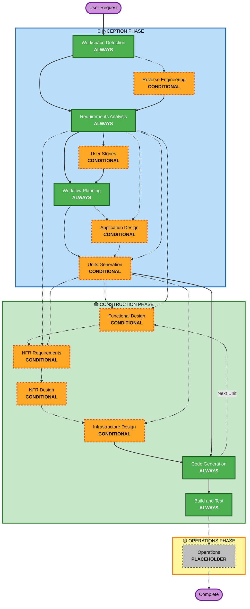

# AI-DLC Adaptive Workflow Overview

**Purpose**: Technical reference for AI model and developers to understand complete workflow structure.

**Note**: Similar content exists in welcome-message.md (user welcome message) and README.md (documentation). This duplication is INTENTIONAL - each file serves a different purpose:
- **This file**: Detailed technical reference with Mermaid diagram for AI model context loading
- **welcome-message.md**: User-facing welcome message with ASCII diagram
- **README.md**: Human-readable documentation for repository

## The Three-Phase Lifecycle:
• **INCEPTION PHASE**: Planning and architecture (Workspace Detection + conditional phases + Workflow Planning)
• **CONSTRUCTION PHASE**: Design, implementation, build and test (per-unit design + Code Generation + Build & Test)
• **OPERATIONS PHASE**: Placeholder for future deployment and monitoring workflows

## The Adaptive Workflow:
• **Workspace Detection** (always) → **Reverse Engineering** (brownfield only) → **Requirements Analysis** (always, adaptive depth) → **Conditional Phases** (as needed) → **Workflow Planning** (always) → **Code Generation** (always, per-unit) → **Build and Test** (always)

## How It Works:
• **AI analyzes** your request, workspace, and complexity to determine which stages are needed
<!-- BEGIN GENERATED: canon-lists | do not hand-edit — regenerated by scripts/generate.py from stage frontmatter (see references/common/stage-contract.md) -->
• **These stages always execute**: Workspace Detection, Requirements Analysis, Workflow Planning, Code Generation, Build and Test
• **All other stages are conditional**: Reverse Engineering, User Stories, Application Design, Units Generation, Functional Design, NFR Requirements, NFR Design, Infrastructure Design
<!-- END GENERATED: canon-lists -->
• **No fixed sequences**: Stages execute in the order that makes sense for your specific task

## Your Team's Role:
• **Answer questions** in dedicated question files using [Answer]: tags with letter choices (A, B, C, D, E)
• **Option E available**: Choose "Other" and describe your custom response if provided options don't match
• **Work as a team** to review and approve each phase before proceeding
• **Collectively decide** on architectural approach when needed
• **Important**: This is a team effort - involve relevant stakeholders for each phase

## AI-DLC Three-Phase Workflow:

<!-- BEGIN GENERATED: stage-flowchart | do not hand-edit — regenerated by scripts/generate.py from stage frontmatter (see references/common/stage-contract.md) -->

<!-- END GENERATED: stage-flowchart -->

**Stage Descriptions:**

<!-- BEGIN GENERATED: stage-descriptions | do not hand-edit — regenerated by scripts/generate.py from stage frontmatter (see references/common/stage-contract.md) -->
**🔵 INCEPTION PHASE** - Planning and Architecture
- Workspace Detection: Always executes — detects existing workflow state and codebase, resumes prior work or classifies greenfield/brownfield (ALWAYS)
- Reverse Engineering: Executes when existing codebase detected and no prior reverse-engineering artifacts exist; skipped for greenfield or when artifacts already exist (CONDITIONAL)
- Requirements Analysis: Always executes with adaptive depth — every request needs its intent and requirements assessed; depth (minimal/standard/comprehensive) scales with clarity, complexity, and risk (ALWAYS)
- User Stories: Executes for user-facing features, workflow changes, or complex business requirements; skipped only for pure internal refactoring, simple bug fixes, or documentation-only changes (CONDITIONAL)
- Workflow Planning: Always executes — determines which stages to execute, their depth, and the execution sequence; user can override recommendations (ALWAYS)
- Application Design: Executes when new components/services or component methods and business rules need definition; skipped for changes within existing component boundaries or pure implementation changes (CONDITIONAL)
- Units Generation: Executes when the system needs decomposition into multiple units of work or services; skipped for single straightforward implementations (CONDITIONAL)

**🟢 CONSTRUCTION PHASE** - Design, Implementation & Test
- Functional Design: Executes when the unit has new data models, complex business logic, or business rules needing detailed design; skipped for simple logic changes (CONDITIONAL, per-unit)
- NFR Requirements: Executes when performance, security, or scalability requirements exist or tech stack selection is required; skipped when no NFR requirements and tech stack already determined (CONDITIONAL, per-unit)
- NFR Design: Executes when NFR Requirements was executed and NFR patterns need to be incorporated; skipped when no NFR requirements exist (CONDITIONAL, per-unit)
- Infrastructure Design: Executes when infrastructure services need mapping, deployment architecture, or cloud resource specification; skipped when no infrastructure changes or infrastructure already defined (CONDITIONAL, per-unit)
- Code Generation: Always executes for each unit — generates code, tests, and artifacts through an approved two-part plan (ALWAYS, per-unit)
- Build and Test: Always executes after all units complete — generates comprehensive build and test instructions for all units (ALWAYS)

**🟡 OPERATIONS PHASE** - Placeholder
- Operations: Placeholder for future deployment and monitoring workflows — the workflow currently ends after Build and Test (PLACEHOLDER)
<!-- END GENERATED: stage-descriptions -->

**Key Principles:**
- Phases execute only when they add value
- Each phase independently evaluated
- INCEPTION focuses on "what" and "why"
- CONSTRUCTION focuses on "how" plus "build and test"
- OPERATIONS is placeholder for future expansion
- Simple changes may skip conditional INCEPTION stages
- Complex changes get full INCEPTION and CONSTRUCTION treatment