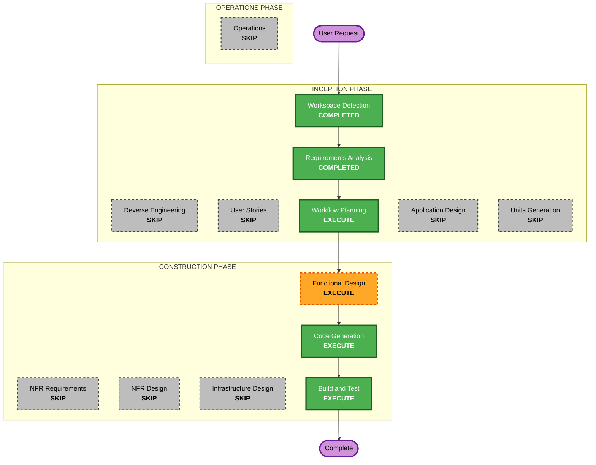

# Execution Plan — course-schedule

## Scope and Depth
- **Scope**: classic
- **Depth**: standard
- **Per-stage Overrides**: application-design、units-generation、nfr-requirements、nfr-design、infrastructure-design 从 classic 基线的 CONDITIONAL 判定为 SKIP（理由见各阶段条目）；functional-design 判定为 EXECUTE（minimal 深度）

## Detailed Analysis Summary

### Change Impact Assessment
- **User-facing changes**: Yes — 全新面向用户的响应式网页应用（大学生个人课表）
- **Structural changes**: No — 绿地新建，无既有架构
- **Data model changes**: Yes — 需新建本地数据模型（课程、学期设置、节次时间表），仅存 localStorage
- **API changes**: No — 纯前端，无 API
- **NFR impact**: Low — 仅响应式布局与本地性能要求；技术栈已在需求阶段确定（Vue 3 + Vite）

### Risk Assessment
- **Risk Level**: Low
- **Rollback Complexity**: Easy（纯前端静态应用）
- **Testing Complexity**: Simple（组件/工具函数单测 + 构建验证）

### Implicit Single Unit
Units Generation 不在计划中。整个任务视为**单一隐式单元**，单元名为 `course-schedule`；每个 per-unit 建设阶段仅对该单元执行一次，输入取自 `aidlc-docs/inception/requirements/requirements.md`。

## Workflow Visualization

### Mermaid Diagram



### Text Alternative

```
Phase 1: INCEPTION
- Workspace Detection (COMPLETED)
- Reverse Engineering (SKIP - greenfield)
- Requirements Analysis (COMPLETED)
- User Stories (SKIP - single-user simple tool)
- Workflow Planning (EXECUTE - this stage)
- Application Design (SKIP)
- Units Generation (SKIP - implicit single unit)

Phase 2: CONSTRUCTION
- Functional Design (EXECUTE, minimal depth, per-unit x1)
- NFR Requirements (SKIP - tech stack already determined)
- NFR Design (SKIP)
- Infrastructure Design (SKIP - pure frontend, no infra)
- Code Generation (EXECUTE, per-unit x1)
- Build and Test (EXECUTE)

Phase 3: OPERATIONS
- Operations (SKIP - placeholder)
```

## Phases to Execute

### 🔵 INCEPTION PHASE
- [x] Workspace Detection - EXECUTE (ALWAYS)
  - **Rationale**: 工作流入口，已完成
- [x] Reverse Engineering - SKIP
  - **Rationale**: Greenfield，无既有代码库
- [x] Requirements Analysis - EXECUTE (ALWAYS)
  - **Rationale**: 需求已确认并获批准
- [x] User Stories - SKIP
  - **Rationale**: 单用户个人工具、简单 CRUD，无多角色/复杂业务流，用户故事无增量价值
- [ ] Workflow Planning - EXECUTE (ALWAYS)
  - **Rationale**: 本阶段
- [ ] Application Design - SKIP
  - **Rationale**: 单一纯前端小应用，无服务层、无复杂组件依赖；组件结构在 Functional Design 中覆盖即可
- [ ] Units Generation - SKIP
  - **Rationale**: 无需分解，按隐式单一单元 `course-schedule` 处理

### 🟢 CONSTRUCTION PHASE
- [ ] Functional Design - EXECUTE (per-unit, minimal 深度)
  - **Rationale**: 有新数据模型（课程实体、学期设置、节次时间表）和周次计算等业务规则需要定义
- [ ] NFR Requirements - SKIP (per-unit)
  - **Rationale**: 技术栈已在需求阶段确定（Vue 3 + Vite + localStorage），无额外性能/安全/扩展性要求
- [ ] NFR Design - SKIP (per-unit)
  - **Rationale**: NFR Requirements 已跳过，无 NFR 模式需要落地
- [ ] Infrastructure Design - SKIP (per-unit)
  - **Rationale**: 纯前端静态应用，无基础设施与部署架构需求
- [ ] Code Generation - EXECUTE (ALWAYS)
  - **Rationale**: 生成全部应用代码与测试
- [ ] Build and Test - EXECUTE (ALWAYS)
  - **Rationale**: 构建与测试说明，验证交付物

### 🟡 OPERATIONS PHASE
- [ ] Operations - SKIP
  - **Rationale**: 占位阶段，当前不执行

## Estimated Timeline
- **Total Stages Remaining**: 4（Workflow Planning、Functional Design、Code Generation、Build and Test）
- **Estimated Duration**: 单会话内可完成

## Success Criteria
- **Primary Goal**: 交付一个可本地运行的响应式课程表网页应用（Vue 3 + Vite，纯前端）
- **Key Deliverables**: 课表周/日视图、课程增删改、课前提醒、localStorage 持久化 + JSON 导入导出、单元测试、构建说明
- **Quality Gates**: 构建通过；单元测试通过；功能覆盖 requirements.md 的 FR-1 ~ FR-4
